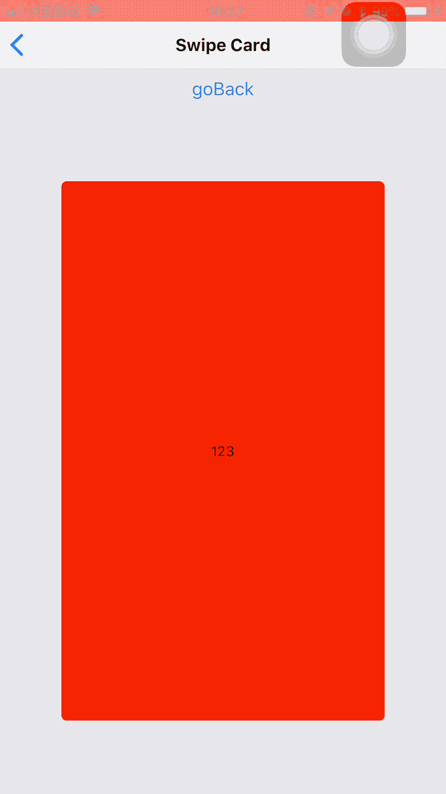

# react-native-swipe-card

一个支持手势切换的卡片组，支持依次返回切掉的卡片

## Preview



## 使用 Demo

```
import { CardStack, Card } from '../components/SwipeCard'


<CardStack
  ref={ref => (this.cardStack = ref)}
  style={styles.container}
  handleCurCard={this.getCurIndex}
  renderNoMoreCards={() => <Text>再也没有了！！</Text>}
  >
  {clothes.map((cloth, index) => (
    <Card style={[styles.card]} key={index}>
      <Image source={cloth} style={{ width: windowWidth - 20, height: 500 }} />
    </Card>
  ))}
</CardStack>
```

##  Props

### CardStack
| Props               | type   | description                                  | required | default |
| ------------------- | ------ | -------------------------------------------- | -------- | ------- |
| verticalThreshold   | number | 垂直方向，滑动距离超过该值时，card才会被移除 | No       |         |
| horizontalThreshold | number | 水平方向，滑动距离超过该值时，card才会被移除 | No       |         |
| renderNoMoreCards   | func   | 当没有 Card 之后，显示的样式                 | No       |         |
| handleCurCard       | func   | 当切换Card之后，调用该函数                   | No       |         |


#### Card
| Props    | type   | description      | required | default |
| -------- | ------ | ---------------- | -------- | ------- |
| style    | object | 单个卡片框的样式 | No       |         |
| children | node   | 卡片的内容       | Yes      |         |