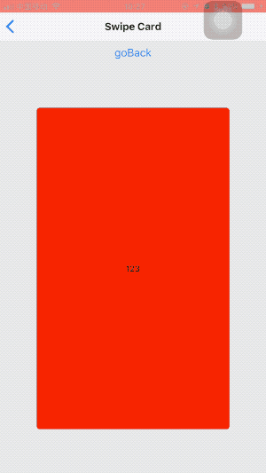

# react-native-swipe-card

一个支持手势切换的卡片组，支持依次返回切掉的卡片

## Preview



## 使用 Demo

```
import React from 'react'
import { Image, View } from 'react-native'
import ZoomImage from '../components/ZoomImage'

export default function ZoomImageExample() {
  return (
    <View style={{ flex: 1, justifyContent: 'center', alignItems: 'center' }}>
      <ZoomImage source={require('../../../../XMKOH81.jpg')} width={300} height={300} />
    </View>
  )
}
```

##  Props

| Props         | type     | description                                                         | required | default |
| ------------- | -------- | ------------------------------------------------------------------- | -------- | ------- |
| source        | any      | 同 Image 的source                                                   | Yes      |         |
| width         | number   | 图片初始的宽                                                        | No       |         |
| height        | number   | 图片初始的高                                                        | No       |         |
| style         | object   | 样式                                                                | No       |         |
| canRotate     | bool     | 能否旋转                                                            | No       |         |
| canZoom       | bool     | 能否缩放                                                            | No       |         |
| onHandleTouch | function | 外部处理当前图片是否正处理手势操作状态<br />（是：true；否：false） | No       |         |

